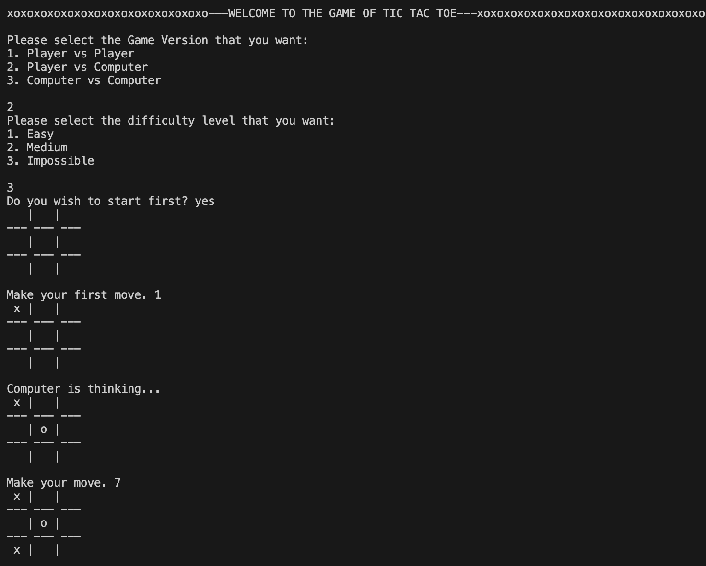

# Minimax Tic-Tac-Toe
This is an A.I x and o game in Python that uses the console for interface.

## Description
It uses an implementation of the mini-max algorithm to achieve for simulate its artificial intelligence. It is heavily Object Oriented.
The game has 3 different versions; Player vs Player, Player vs Computer and Computer vs Computer

The Player vs Computer version is the main part of this project. This version has 3 difficulty levels:
* Easy (The computer here is dumb because it just randomizes available moves and picks any of them)
* Medium (In this difficulty level, you can win the computer sometimes as it does not always play perfectly)
* Impossible (In this difficulty level, you can never win the computer; a pretty bold statement eh?)

In the Computer vs Computer version, it always ends in a draw since they both play perfectly.

The computer was made intelligent by the implementation of the [minimax algorithm](https://www.youtube.com/watch?v=l-hh51ncgDI&t=494s) with some [alpha-beta prunning](https://www.youtube.com/watch?v=STjW3eH0Cik&t=1659s).

## Usage
Code execution starts by running `python main.py` in terminal.
To play the game, numbers have to be inputted with no spaces before or after. 1 represents the top left of the board, 2 represents the top middle space, 3 represents the top left part, 4 represents the mid left of the board, etc.

The reply to the questions that require you to choose from a list of options should be numbers, while the reply to yes/no questions should be 'yes' or 'no'. Example below:
* _Do you wish to start first_: _yes_ or _no_ 
* Which game version do you want: _1_ or _2_ or _3_

## Example
Below is an excerpt from a game that was played:

No error handling is enabled, so if a wrong input is entered (inputting a number where a piece already exists for instance), the game either just ends or crazy things happen.

> _I have no special talents. I am only passionately curious._ ~ **Albert Einstein**